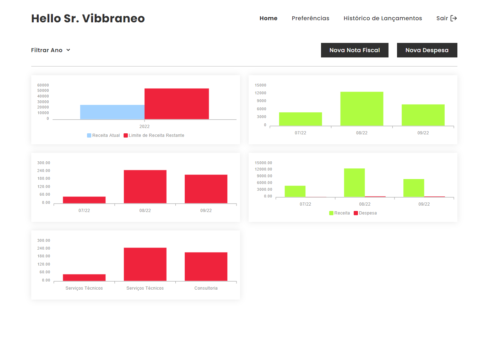

# Vibbra Challenge [BackOffice](https://vibbra-challenge.vercel.app/)


## Desafio

Desenvolver um app para empreendedores formalizados como Microempreendedores Individuais que buscam uma forma de organizar suas Receitas (geração de Notas Fiscais) e Despesas para evitar surpresas com pagamento de impostos ao final do ano.
<br>

## Escopo
No total são 6 criações 

<br>

- Tela de Autenticação / Cadastro
- Tela de Dashboard de Dados
  - Com opção de criar nota fiscal
  - Com opção de criar despesa
- Tela de Preferências
  - Com opção de criar empresa
  - Com opção de criar categorias de despesas
- Tela de Histórico
  - Listagem de notas fiscais
  - Listagem de despesas

## Technologies

Technologies and tools used in the development of the project:

- [Next](https://nextjs.org/)
- [TypeScript](https://www.typescriptlang.org/)
- [Styled Components](https://styled-components.com/)
- [Redux](https://redux.js.org/)
- [Axios](https://github.com/axios/axios)
- [Mirage](https://miragejs.com/)
- [Apexcharts](https://apexcharts.com/)
<br>

## Deploy

App implementando na vercel, disponível [aqui](https://vibbra-challenge.vercel.app/)

## Usuário
**Email:**<br>
srvibbraneo@gmail.com<br>
**Senha:**<br>
123456<br>

## Etapas

**\#1 .. Design:**

Criei design simples, limpo e de fácil uso para priorizar outros tópicos devido prazo corrido do teste.

**\#2 .. Mock da API:**

Criei uma API "mockada" com mirageJS com todos os dados de autenticação e negócios e seus relacionamentos.

**\#3 .. Arquitetura:**

Criei uma arquitetura com foco em separação de dados de negócio das interfaces, a intenção é deixa um hook customizado que é responsável por buscar dados de negócio, formatar, calcular... e então servir dados ou handles para interface limpa

**module/business** Ficam regras de negócios
<br>
**module/view** Interfaces independentes
<br>
**module/context** Dados persistidos por módulo
<br>
**src/store** Dados persistidos globalmente no app
<br>

## Run Project

Add dependencies:


```
yarn

```
Run app:


```
yarn dev
```

## Licença
<a href="https://opensource.org/licenses/MIT">
    
</a>
<br>

---
Made with 💖 by [**mmarinhomac**](https://github.com/mmarinhomac)